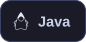
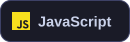
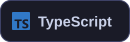
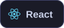
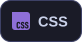
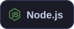
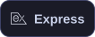
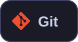
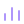

  <picture>
    <source media="(prefers-color-scheme: dark)" srcset="assets/name-dark.svg">
    
  </picture>

  <b>Full-Stack Developer</b>

  Currently a <b>Software Development Engineer @ Reno Platforms</b>, working across
  frontend, backend, APIs, databases, and production systems.

  &nbsp;&nbsp;
  &nbsp;&nbsp;
  &nbsp;&nbsp;
  &nbsp;&nbsp;
  

 

##  About

I'm a Computer Science graduate who enjoys turning ideas into scalable, user-focused products. My day-to-day work spans the full stack — modern interfaces, backend services and REST APIs, database-driven systems, authentication and role-based access, and admin dashboards that hold up in production.

I care about software architecture, scalable systems, and clean engineering, and I'm currently going deeper into system design, database design, and production engineering. Always open to interesting collaborations and challenging problems.

 

##  Tech Stack

<b>Languages</b>

  
  
  
  
  

<b>Frontend</b>

  
  
  

<b>Backend</b>

  
  

<b>Databases</b>

  
  

<b>Tools</b>

  
  
  

 

##  GitHub Statistics

  

  
  

  

 

##  Let's Connect

I'm always interested in building useful products, learning new technologies, and collaborating on interesting ideas. The fastest ways to reach me:

  &nbsp;&nbsp;
  

 

  <i>Build. Learn. Improve. Repeat.</i>

